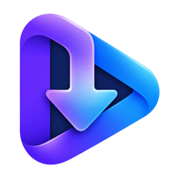
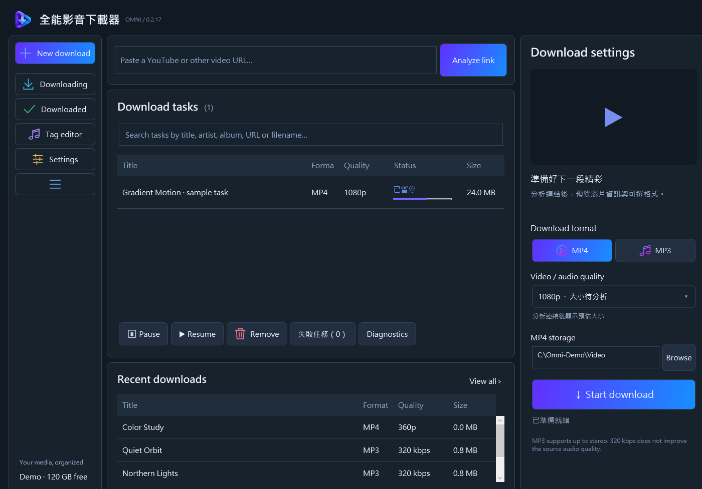
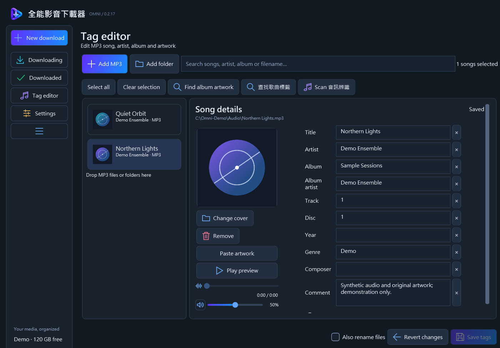
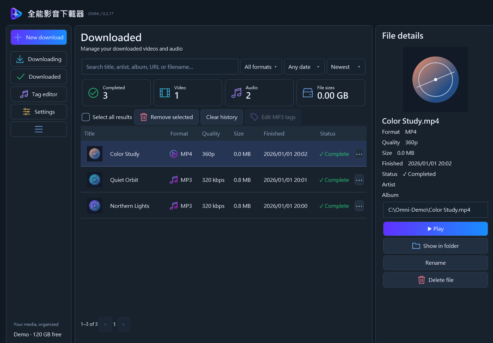
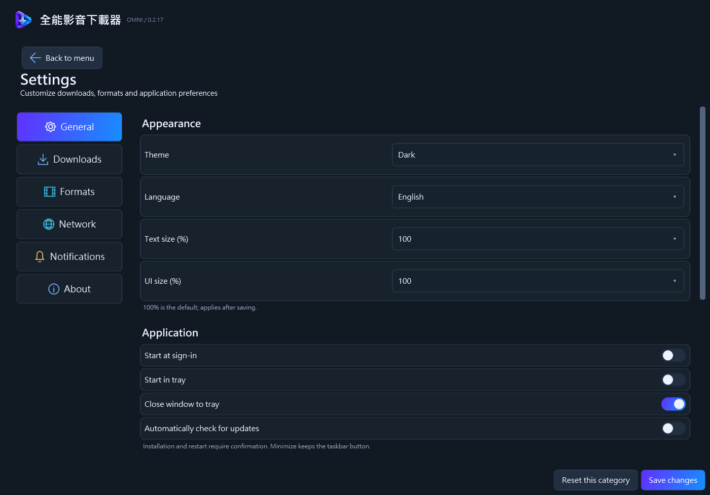

<p align="center"></p>
<h1 align="center">Omni Downloader</h1>
<p align="center">下载影音、管理文件、编辑音频标签，并核对音乐识别结果。</p>

<p align="center">
  <a href="https://github.com/HKmario852/mp4-mp3-downloader/releases/latest"></a>
  <a href="https://github.com/HKmario852/mp4-mp3-downloader/releases"></a>
  
  <a href="../../LICENSE"></a>
</p>

<p align="center"><a href="../../README.md">English</a> · <a href="README.zh-TW.md">繁體中文</a> · <strong>简体中文</strong> · <a href="README.ja.md">日本語</a> · <a href="README.ko.md">한국어</a> · <a href="README.es.md">Español</a></p>

<p align="center">
  <a href="../../docs/screenshots/windows-downloads.png"></a>
  <a href="../../docs/screenshots/windows-tag-editor.png"></a>
</p>

*Windows 截图使用合成示例媒体与原创几何封面。点击可放大。*

<details>
<summary>更多截图</summary>




</details>

## 功能

- 📥 使用 yt-dlp 下载视频与播放列表，支持排队、暂停、续传和任务管理。
- 🎞️ 可选 MP4、MKV、WebM、MP3、Opus、M4A、FLAC 或 WAV，实际选项取决于来源。
- 🏷️ 批量编辑 MP3、Opus、M4A 和 FLAC 标签，嵌入接近正方形的封面，不另存 JPG 文件。
- 🔎 导入前核对 AcoustID／MusicBrainz 匹配，只应用选中的字段，并可保留撤销记录。
- 🎧 Windows 会记住添加的音乐文件夹，切换页面时继续播放预览音频。
- 🌐 通过浏览器扩展，将 Chrome 或 Brave 的 YouTube 链接发送到 Windows 应用。

## 下载／安装

请到 **[最新版本页面](https://github.com/HKmario852/mp4-mp3-downloader/releases/latest)** 下载。

| 平台 | 系统要求 | 安装方式 |
| --- | --- | --- |
| Windows | Windows 10（2004+）或 11，x64 | 将 Windows ZIP 解压到可写入的文件夹，运行 `OMNI.exe`；保留所有附带文件。 |
| Android | Android 8.0+（API 26） | 安装通用 APK。选择共享文件夹，避免卸载时一并删除下载文件。 |
| 浏览器扩展 | Windows 上的 Chrome／Brave | 加载解压后的扩展，并在应用设置中连接其 ID。[设置步骤](../../docs/DEVELOPMENT.md#browser-connection)。 |

> **注意:**
> Windows 可执行文件未签名。从 0.2.21 起 Android APK 为已签名的正式版本；如曾安装较早的测试（debug）版本，请先卸载一次再安装，因为 Android 不能跨签名密钥更新。真机和后台服务验证尚未完成。
>
> 两个平台都会在版本之间自动更新 yt-dlp（设置 › 关于，默认每日检查），并用 GitHub 提供的 SHA-256 校验下载。

> [!NOTE]
> 旧版使用 `App.exe`。首次改用新名称时，请完全退出应用，将完整的 Windows 更新包解压到原文件夹，保留 `data/` 和 `native-host.json`，然后启动 `OMNI.exe`。

## 快速开始

1. 在 **新增下載**（新建下载）粘贴视频或播放列表网址，点击 **分析連結**（分析链接）。
2. 选择格式、质量与保存位置，开始下载。
3. 在 **已下載** 查看完成的文件。进入 **標籤編輯** 添加 MP3、Opus、M4A、FLAC 或文件夹，修改标签与封面。
4. 识别歌曲时，选中一个支持的音频文件并点击 **Scan 音訊辨識**。核对候选版本和更改后，只有明确应用的字段与封面才会写入。

## 从源码构建

在 Windows 安装 **.NET 8 SDK 或更新版本**，然后在 PowerShell 中运行：

```powershell
git clone https://github.com/HKmario852/mp4-mp3-downloader.git
cd mp4-mp3-downloader
./scripts/Build-Windows.ps1
```

输出：`artifacts/windows-win-x64/OMNI.exe`。脚本会下载并校验附带的媒体工具；发布版已包含 .NET 运行时。

构建 Android 还需要 **JDK 21**、**Android SDK／build-tools 35**、**NDK 27.0.12077973** 和 **CMake 3.22.1**。设置 `JAVA_HOME` 与 `ANDROID_HOME` 后运行：

```powershell
./scripts/Build-Android.ps1 -JavaHome $env:JAVA_HOME -AndroidHome $env:ANDROID_HOME
```

输出：`artifacts/OmniDownloader-universal.apk`（用你的正式密钥签名；先运行一次 `./scripts/Setup-AndroidSigning.ps1` 创建）和 `artifacts/OmniDownloader-universal-debug.apk`。脚本也会构建 instrumentation 测试并运行 JVM 单元测试。架构、检查和打包方式见 [开发指南](../../docs/DEVELOPMENT.md)。

## 设置

- 在 **設定** 调整保存位置、格式、质量、字幕与封面选项。独立视频缩略图 **默认关闭**。
- 原生 Opus／M4A 保留源文件的编码音频。MP3 可选 CBR 或 VBR V0；新 MP3 默认 ID3v2.3，可选 ID3v2.4。FLAC 不会提升有损源的音质。[音频管线](../../docs/AUDIO-PIPELINE.md)。
- Windows 默认在 **下载完成后** 于后台查找 MP3 标签，可改为下载前或关闭。Android 自动标签匹配默认关闭，但封面后备流程仍可能查询 MusicBrainz。
- 应用提供 **繁体中文与英文** 设置，但翻译尚未完成：部分页面与浏览器扩展仍为中文。README 翻译不代表新增界面语言。
- 受限内容可能需要具有访问权限的账号所导出的 Netscape 格式 cookies 文件，请勿分享。[浏览器连接](../../docs/DEVELOPMENT.md#browser-connection) · [音乐识别](../../docs/MUSIC-RECOGNITION.md)。

## 技术栈

- **Windows：** C#、.NET 8、WPF、SQLite。
- **Android：** Kotlin、Jetpack Compose、SQLite、Storage Access Framework。
- **媒体与集成：** yt-dlp、FFmpeg、Deno、Chromaprint、MusicBrainz、AcoustID、JavaScript／Manifest V3。

## 隐私／免责声明

设置和历史记录保存在本机。下载会连接来源网站，更新检查会连接 GitHub。音乐查询会将标题、艺人、ID 或音频指纹与时长发送至元数据服务，**不会上传音频文件**。浏览器 Cookie 转发需要事先同意。详见 [隐私说明](../../docs/PRIVACY.md)。

请只下载你获准下载的内容。本项目不实现 DRM 解密，也不隶属于所支持的网站。网站支持依赖 yt-dlp，网站变更可能导致下载失效；无法保证来源持续可用或歌曲匹配成功。

## 许可与致谢

本项目采用 **[GPL-3.0-or-later](../../LICENSE)**。感谢 yt-dlp、FFmpeg、youtubedl-android、Deno、Chromaprint、MusicBrainz、AcoustID 和 Cover Art Archive。上游来源与再分发义务见 [第三方声明](../../THIRD-PARTY.md)。
